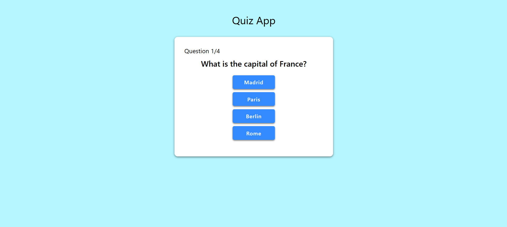
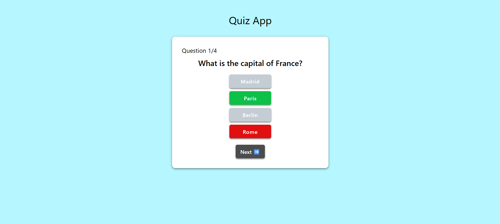

# Quiz App (React) 🎯

This is an interactive quiz application built with **React**. It tests users with multiple-choice questions and gives visual feedback using **confetti** on high scores. The app is responsive and styled with custom CSS.

---

## ✨ Features

- Multiple-choice question format
- Correct/incorrect answer highlighting
- Score tracking with `useRef`
- Final score screen with conditional **confetti effect**
- "Retry" button with a refresh icon to restart the quiz

---

## 📸 Preview





---

## 🛠 Tech Stack

- React (Vite)
- JavaScript
- CSS
- [`react-confetti`](https://www.npmjs.com/package/react-confetti)
- [`react-use`](https://www.npmjs.com/package/react-use) for `useWindowSize`

---

## 📦 Installation & Running Locally

1. **Clone the repository**  
   ```bash
   git clone https://github.com/yourusername/react-quiz-app.git
   cd react-quiz-app

2. **Install dependencies**

```bash
npm install
```

3. **Start the development server**

```bash
npm run dev    # or `npm start` if using Create React App
```